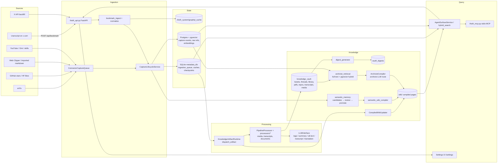

# Thoth — High-Level Overview

Thoth is a personal knowledge system that turns the firehose of things you save — X bookmarks, arXiv papers, GitHub stars, HuggingFace likes, web clippings, YouTube videos, voice transcripts — into a **compiled, queryable wiki you can actually trust**. Raw captures flow in, get enriched by LLMs into markdown artifacts in a synced vault, and a topic-scoped "archivist" compiles curated wiki pages on top (inspired by Karpathy's persistent-LLM-wiki idea). You browse the result in Obsidian; agents query it over a read-only MCP server.

The problem it solves is not capture — it's that captured knowledge rots. Bookmarks pile up unread, summaries can't be checked, and an LLM digest fed on untrusted web content is one prompt-injection away from garbage. Thoth's answer is three design commitments:

## Trust: every claim is traceable

- **Citations are enforced, not requested.** The archivist must cite every concrete claim inline as `[S#]` labels drawn only from its input packet (`prompts/archivist_system.md`); the compiler *rejects* pages with out-of-range labels or untrusted numeric citations (`core/archivist_compiler.py`). Each page gets a deterministic `## Sources` section linking back to the vault files, with trust scores and reasons.
- **Provenance is structural.** Every artifact carries an `ArtifactProvenance` record — source identity, immutable raw payload reference with SHA-256, queue lineage (`core/artifacts/base.py`). Every wiki page records a hash of its full input manifest and *why* it recompiled (`core/wiki_change_provenance.py`), so `admin_lineage.py` can answer "where did this page come from and what changed" for any page.
- **Dedup fails loud.** Canonical identity resolution (arxiv ID, DOI, tweet ID, URL, content hash) merges duplicates deterministically, and ambiguous matches raise for operator review instead of being silently merged (`core/canonical_identity.py`).
- **Agents inherit the trust.** `AgentSurfaceService` exposes `get_artifact_provenance` / `inspect_provenance` over MCP, so an agent answering from Thoth can show its work.

## Security: untrusted content is treated as hostile

- **Prompt-injection defense at the boundary.** All ingested content is scanned against ~24 named attack patterns (instruction overrides, fake citations, secret exfiltration, invisible Unicode, multilingual attacks) before it reaches an LLM, wrapped in `<THOTH_UNTRUSTED_CONTEXT>` markers, and classified `allowed` / `needs_review` / `blocked` — strict sources fail closed (`core/prompt_security.py`).
- **Secrets never reach the model.** `sensitive_redaction.py` strips API keys, tokens, private keys, and PII before LLM calls, keeping only redaction metadata. LLM responses are parsed fail-closed (`core/llm_validation.py`).
- **Locked-down generation.** The Pi CLI provider runs with `--no-tools --no-session --no-context-files` — the model can write text and nothing else.
- **Explicit trust boundary.** The FastAPI service has no authentication of its own; it is a local personal service whose only boundary is CORS restricted to x.com and browser extensions. X API access uses OAuth2 PKCE with atomically persisted tokens.

## Human-in-the-loop: nothing becomes durable knowledge without review

- Malformed, oversized, or quarantined captures land in an **artifact review queue** with an append-only audit trail; operator actions (`retry`, `reject`, `mark_reviewed`) require an actor and a reason (`core/artifact_review_queue.py`).
- Extracted "semantic memory" facts start as `proposed` and only reach the wiki after operator confirmation — and promotion additionally requires corroboration (default: ≥2 evidence items from ≥2 distinct sources) with every gate decision stored for audit (`core/semantic_memory_promotion.py`). The wiki compiler only reads `confirmed`/`promoted` facts.

## The three layers

1. **Ingestion** — A userscript captures X bookmarks as they happen (`POST /api/bookmark`), plus X API backfill; collectors pull arXiv, GitHub stars, HF likes, web clippings, YouTube, Omi transcripts, and skill outputs. Everything funnels into one `ingestion_queue` with raw payloads cached in `.thoth_system/`.
2. **Processing** — `core/ingestion_runtime.py` dispatches queued artifacts to `processors/`: tweet/thread enrichment, document processing (papers, PDFs, READMEs), transcription (Whisper/Deepgram), and LLM tasks (tags, summaries, alt-text, translation) via a routed multi-provider `LLMInterface` with caching.
3. **Archivist / Analyst** — Topic-scoped compilation: `archivist_retrieval/` selects sources via full-text + pgvector semantic search, the compiler synthesizes cited wiki pages, and agents query the result through `AgentSurfaceService` (API + MCP).

## The Universal Loop

The layers are not a one-way pipeline — they form a loop that compounds:

1. **Capture** — bookmarks, papers, clippings, and transcripts flow in raw.
2. **Compile** — processors and the archivist turn them into cited wiki pages.
3. **Query** — you and agents read the compiled layer.
4. **Feed back** — `wiki-query --write-back` persists curated query results as new wiki pages, the archivist recompiles topics when their input manifest changes (`core/wiki_change_provenance.py`), and digests resurface unread material — which drives the next round of capture.

Each pass makes the wiki a better source for the next one, without raw material ever being rewritten.

## Storage contract (the core design rule)

- `knowledge_vault/` — synced vault: raw + generated artifacts (`tweets/`, `threads/`, `library/`, `pdfs/`, `repos/`, `transcripts/`, `media/`, `_digests/`).
- `wiki/` — compiled wiki output, deliberately *outside* the vault.
- `.thoth_system/` — local-only state: SQLite metadata DB (`core/metadata_db.py`: queues, caches, checkpoints, identity), GraphQL/LLM caches, auth, logs.
- Postgres + pgvector (optional, `compose.dev.yml`) — capture events, raw refs, and embedding vectors for semantic retrieval.

## Entrypoints

- `thoth.py` — CLI, ~25 subcommands (`process`, `pipeline`, `x-api-sync`, `arxiv`, `social`, `web-clipper`, `archivist`, `wiki-query`, `digest`, `ingest-queue`, ...).
- `thoth_api.py` — FastAPI server: capture receiver + `/settings` operator control plane.
- `thoth_mcp.py` — MCP stdio server for agents.

## Data Flow

## Caveats when reading the checkout

- `knowledge_vault/` is empty in the repo (runtime-populated and gitignored).
- Postgres is optional — SQLite is the default metadata store; pgvector is needed only for semantic archivist retrieval and semantic memory.
